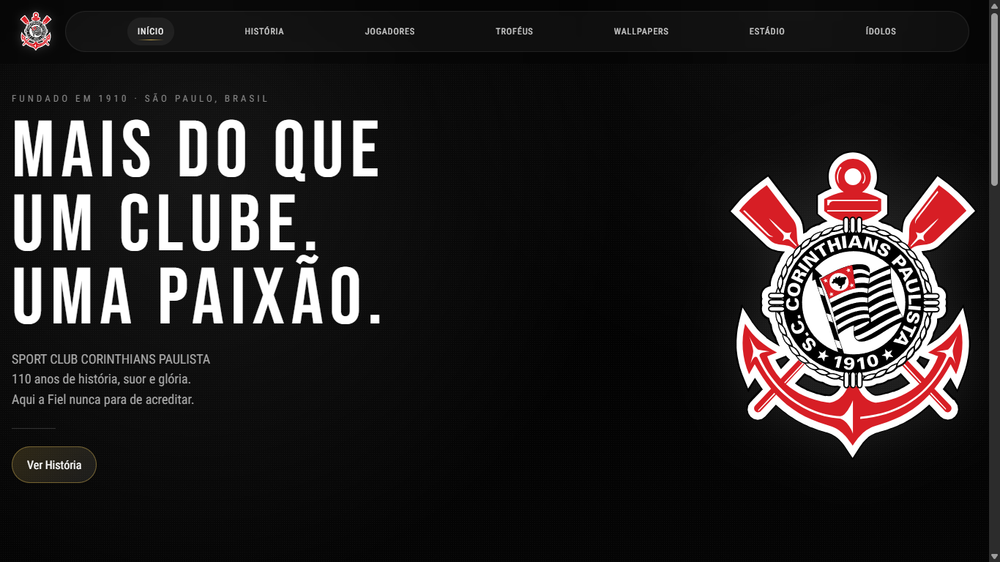
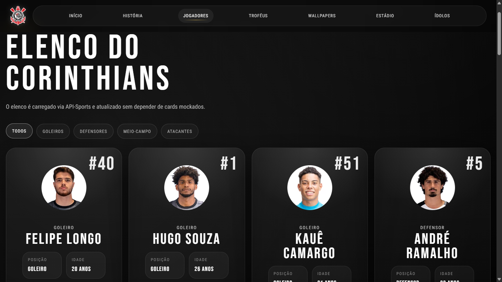
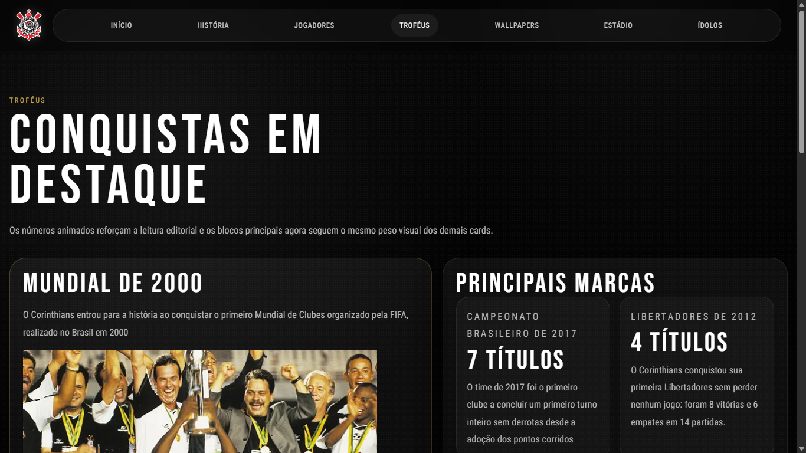

<div align="center">

# 🖤🤍 Corinthians Hub

> Site dedicado ao Sport Club Corinthians Paulista — informações, elenco atualizado, títulos, ídolos e muito mais.

🔗 **Acesse o site:** [clique aqui](https://seu-link-aqui.com)

## 📸 Screenshots

| Home | Jogadores |
|------|-----------|
|  |  |

| Títulos | Ídolos |
|---------|--------|
|  |  |

</div>

---

## 📋 Sobre o Projeto

Projeto Pessoal sobre o **Corinthians**, desenvolvido com foco em design moderno e dados atualizados em tempo real via integração com a **API-Football (api-sports.io)**. O elenco é atualizado automaticamente a cada **3 dias**, garantindo informações sempre precisas sem consumo excessivo da API.

---

## 🗂️ Páginas

| Aba | Descrição |
|---|---|
| 🏠 **Home** | Página inicial com destaque visual do clube |
| 🏆 **Títulos** | Todos os títulos conquistados pelo Corinthians |
| 👕 **Jogadores** | Elenco ativo com foto, posição, número e idade — atualizado via API |
| 🖼️ **Wallpapers** | Coleção de wallpapers do clube para download |
| ⭐ **Ídolos** | Principais ídolos da história com biografia individual |

---

## ⚙️ Tecnologias

- **[Next.js](https://nextjs.org/)** — Framework React com SSR e rotas API nativas
- **[TypeScript](https://www.typescriptlang.org/)** — Tipagem estática para maior segurança no desenvolvimento
- **[Tailwind CSS](https://tailwindcss.com/)** — Estilização utilitária com tema nas cores do Corinthians
- **[API-Football v3](https://www.api-football.com/)** — Dados de jogadores e títulos do clube

---

## 🔄 Sistema de Cache — Elenco

Para evitar consumo excessivo da API, o projeto usa um sistema de cache em duas camadas:

```
Primeira visita       → Busca na API-Sports e salva cache
Visitas seguintes     → Retorna cache salvo (sem nova requisição)
Após 72 horas (3d)   → Renova automaticamente com 1 nova requisição
```

- **Cache no servidor** — resultado salvo em memória/arquivo com timestamp
- **Cache no localStorage** — evita re-requisições dentro da mesma sessão
- O elenco é atualizado sozinho caso haja mudanças (contratações, saídas)

---

## 🚀 Como Rodar Localmente

### Pré-requisitos

- Node.js 18+
- Conta na [API-Sports](https://www.api-football.com/) com chave de API

### Instalação

```bash
# Clone o repositório
git clone https://github.com/Cjr-pjs/Corinthians-Hub
# Acesse a pasta
cd seu-repositorio

# Instale as dependências
npm install
```

### Variáveis de Ambiente

Crie um arquivo `.env.local` na raiz do projeto:

```env
API_SPORTS_KEY=sua_chave_aqui
```

### Executar

```bash
# Modo desenvolvimento
npm run dev

# Build de produção
npm run build
npm start
```

Acesse em: `http://localhost:3000`

---

## 📁 Estrutura de Pastas

```
├── app/
│   ├── page.tsx              # Home
│   ├── titulos/              # Página de títulos
│   ├── jogadores/            # Página de jogadores
│   ├── wallpapers/           # Página de wallpapers
│   ├── idolos/               # Página de ídolos
│   └── api/
│       └── players/          # Rota interna com cache (API-Sports)
├── components/               # Componentes reutilizáveis
├── lib/                      # Funções utilitárias e cache
├── public/                   # Assets estáticos
└── .env.local                # Variáveis de ambiente (não comitar)
```

---

## 🌐 API Utilizada

**API-Football — api-sports.io v3**

| Endpoint | Uso |
|---|---|
| `/players/squads?team=131` | Elenco atual do Corinthians |

> O ID `131` corresponde ao Corinthians na base da API-Sports.

---

## 🔒 Segurança

- A chave da API **nunca é exposta no frontend**
- Todas as chamadas à API-Sports passam pela rota interna `/api/players`
- O arquivo `.env.local` está no `.gitignore`

---

## 📄 Licença

Este projeto é **fan-made** e não possui vínculo oficial com o Sport Club Corinthians Paulista. Desenvolvido apenas para fins educacionais e de aprendizado.

---

<div align="center">

**Feito com  por mais um do bando de loucos**

*Vai Corinthians!*

</div>
